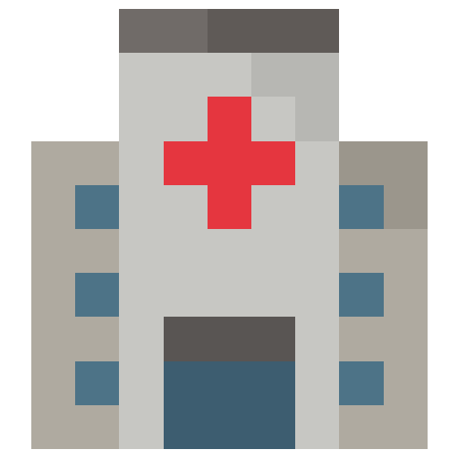

 #  Hospital - The Game

 [](https://hospital.xswing.net/)

### [🎮 Instant Play - Web](https://hospital.xswing.net/)

 Help!
 The hospital is burning. Try to save lives and catch jumping patients.  
 Move your team with the mesh before patients hit the ground.
 Good Luck!

 ### 🌟 Features
 * Realistic smoke rendering
 * Spectacular people animations
 * Blood puddles on the ground
 * In game help menu

 ### ⌨ Controls
 Also printed on start.
 * <kbd>S</kbd> Start game.
 * <kbd>P</kbd> Pause game.
 * <kbd>N</kbd> Start a New game.
 * <kbd>ESC</kbd> Stop the current game.
 * <kbd>1</kbd><kbd>2</kbd><kbd>3</kbd> Change the size of the catching mesh.
 * <kbd>H</kbd> Open the help screen.

 ### 📖 About
 This is one of my first software projects and my first computer game.
 I uploaded it also as a reminder... that I also started very, very simply and wrote horrible code.
 But I was very proud of it, and it was a magic moment seeing others playing my game.
 With exactly 600 lines of code (including imports & JDoc) it's even my shortest game.
 And it doesn't use any graphics. 

 The game play blueprint is the Nintendo _Game & Watch_ Video Game **Fireman** from 1980. 
 It was a monochrome single game handheld gaming device. I never owned an original, but the game
 was included in the Nintendo Game Box Game _Game & Watch Gallery_ from 1997

### ⬇️ Downloads

📦[Hospital-1.1-EN-Installer-WIN.zip](https://github.com/TobseF/Hospital/releases/download/v1.1/Hospital-1.1-EN-Installer-WIN.zip) `31.2 MB`
> All in one Windows Installer. No need to install Java on your own.

📦[Hospital-v1.1-EN-Portable-WIN.zip](https://github.com/TobseF/Hospital/releases/download/v1.1/Hospital-v1.1-EN-Portable-WIN.zip) `26.5 MB`
> Same as installer, but without setup. Just extract the zip archive on Windows and run the game

📦[Hospital-v1.1-EN-JVM.zip](https://github.com/TobseF/Hospital/releases/download/v1.1/Hospital-v1.1-EN-JVM.zip) `0.1 MB`
> Platform independent JAR file. ℹ Requires an installed [Java JRE](https://java.com/en/download/).


### 🔨 Build
To build the project, run the Maven task:
```
mvn package
```
This will build a runnable jar in `target/hospital-1.0-SNAPSHOT-jar-with-dependencies.jar`.

### 📦 Create Windows Executable
To create a minimal runnable Java executable for Windows using JLink, follow these steps:

1. Make sure you have JDK 11 or later installed
2. Update the JAVA_HOME path in the `create-jlink-image.bat` script if needed
3. Run the batch script:
```
create-jlink-image.bat
```
4. This will create a minimal Java runtime with the game in `target/jlink-image`
5. Run the game using the launcher script:
```
target\jlink-image\bin\hospital.bat
```

The JLink image contains only the necessary Java modules required to run the game, resulting in a smaller distribution size compared to bundling the entire JRE.
